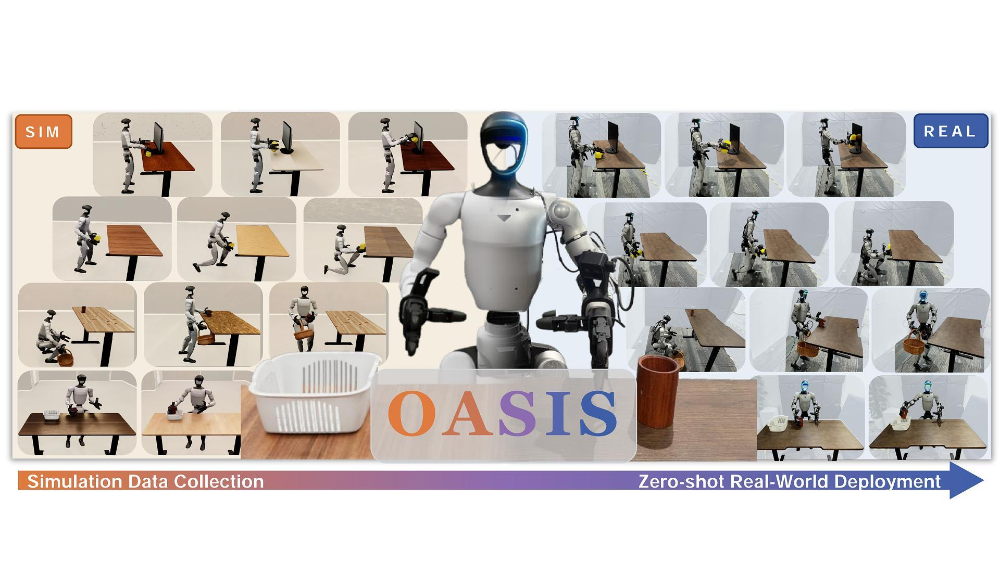

# OASIS: From Simulation Data Collection to Real-World Humanoid Loco-Manipulation

[[**website**](https://oasis-humanoid.github.io/)] [[**arxiv**](https://arxiv.org/abs/2606.08548)] [[**pdf**](https://arxiv.org/pdf/2606.08548)]



## News
- \[2026-6\] We release OASIS, including **data collection code**, **assets** and **paper**.


## 🛠️ Getting Started

### 1. Installation

- Install Isaac Lab v2.2.0 by following the [installation guide](https://isaac-sim.github.io/IsaacLab/main/source/setup/installation/index.html).

```bash
cd IssacLab && ./isaaclab.sh -c oasis
./isaaclab.sh -i
```

- Install OASIS

```bash
git clone https://github.com/TeleHuman/oasis.git
conda activate oasis
cd oasis && pip install -e .
```
To use OASIS objects, download the object dataset from [object dataset](https://drive.google.com/file/d/1Q5izkCbbEV-ke2BSn_fZu2KI9ZeBn1ul/view). ( Ignore if you want to build your own scenes.) Place it at `assets/`.

To use OASIS textures during replay stage, download the texture from [texture dataset](https://drive.google.com/file/d/1d3LgLtdI-rajYZOOGOU6qMwLr7-rQhZ4/view). ( Ignore if you want to use your own textures.) Place it at `assets/`.

- Install GMR and PICO SDK, following [GMR](https://github.com/YanjieZe/GMR)

### 2. Usage

After installing the PICO SDK, you need to first open `XRoboToolkit` on the PICO and check the PICO's IP address, then enter the corresponding IP into the `pico_host` field in `play.sh` and `record.sh`. 

#### Note

- **Due to XRoboToolkit's requirements, your PC must have Ubuntu 22.04 installed.**

- **PICO must be on the same network segment as your PC.**

- **Remember to start `xrobotoolkit-pc-service` on your PC before teleopperation.**


1. Visualize the simulation environment without recording

```bash
conda activate oasis
sh play.sh
```

2. Collect data in headless mode

```bash
conda activate oasis
sh record.sh
```

Run teleop

```bash
conda activate gmr
sh teleop.sh
```

In record mode, the camera feed from the robot's head camera in Isaac Sim will be streamed to the PICO in real time. You need to click `Listen` in the Remote Vision section of `XRoboToolkit` to display the image in the center of your field of view. You can control the data collection lifecycle and gripper behavior using the PICO controllers.

- X —— Start recording data
- Y —— End recording and save the data
- A —— Reset the environment and discard the data currently being recorded
- B —— Switch the first-person view display mode.
- Left Trig / Right Trig —— Close left / right hand
- Left Grip / Right Grip —— Open left / right hand

To improve the frame rate, you can remove the two wrist cameras during recording. Camera generation is configured in `tasks/teleop/scenes/scene_factory.py`. Remember to re-enable them during the replay stage.

3. Replay trajectories offline and apply domain randomization

```bash
sh replay.sh
```

In `replay.sh`, set `input_dir` to the path of the recorded trajectories and `output_dir` to the path where the rendered data will be saved. 

We use Isaac Sim's `PathTracing` mode to apply texture, lighting, and camera extrinsics randomization to the collected trajectories. Rendering requires an NVIDIA RTX series GPU. **The rendering process consumes a significant amount of storage space, so please make sure you have sufficient disk space.**

You can use the `start`, `end`, and `target_envs_per_episode` parameters to specify the starting sequence, ending sequence, and target number of rendered environments per trajectory for the replay.

If your rendering is interrupted midway, don't worry — we use `.done` files to detect whether the current sequence has finished rendering, and rendering will automatically resume from where it left off.

### 3. Generate your own assets

1. Upload photos of your asset to the [Hunyuan3d](https://3d.hunyuan.tencent.com/), generate the 3D model file, and export it in GLB format.
1. Open Isaacsim and import the GLB asset. (you cannot import it by drag-and-drop; instead, navigate to the GLB file's path in the Content browser at the bottom and import it from there).
1. Right-click the Mesh -> Add -> Physics -> Rigid Body with Colliders Preset to add collision. Then, in the mesh's Physics properties, change the collision Approximation to Convex Decomposition.
1. Right-click on Layer → Root Layer → Save A Copy → `assets/objects/${your_object_name}/${your_object_name}.usd`, and import the `${your_object_name}.usd` into Isaacsim.
1. In `/World/Looks/Material_001/baseColorTex`, check the texture path in `Shader/Inputs/Texture/Texture File` under Property. Move the `textures` folder to `assets/objects/${your_object_name}`, and reconfigure the texture paths for `baseColorTex`, `metallicRoughnessTex`, and `normalTex`.
1. Adjust the scale in Transform to set the size. The object's actual physical dimensions can be obtained via the script below. You need to open `Window` -> `Script Editor`, copy this script into it, and run it.

```bash
import omni.usd
from pxr import Usd, UsdGeom                                                   
                                                                                 
stage = omni.usd.get_context().get_stage()                                     
prim_path = "/World"                                         
prim = stage.GetPrimAtPath(prim_path)                                        
                                                                                 
bbox_cache = UsdGeom.BBoxCache(
      Usd.TimeCode.Default(),                                                    
      includedPurposes=[UsdGeom.Tokens.default_]                               
)                                                                              
bbox = bbox_cache.ComputeWorldBound(prim)                                    
r = bbox.ComputeAlignedRange()
mn, mx = r.GetMin(), r.GetMax()                                                
                                        
size_x = mx[0] - mn[0]                                                         
size_y = mx[1] - mn[1]                                                         
size_z = mx[2] - mn[2]                      
                                                                                
print(f"prim: {prim_path}")                                                  
print(f"min = ({mn[0]:.4f}, {mn[1]:.4f}, {mn[2]:.4f})")                        
print(f"max = ({mx[0]:.4f}, {mx[1]:.4f}, {mx[2]:.4f})")
print(f"size: L={size_x:.4f} m, W={size_y:.4f} m, H={size_z:.4f} m")            
```

## Acknowledgements

OASIS builds upon code from [unitree_sim_isaaclab](https://github.com/unitreerobotics/unitree_sim_isaaclab) and [TWIST2](https://github.com/amazon-far/TWIST2), and uses [Teleopit](https://github.com/BotRunner64/Teleopit) as its low-level controller.

## Contact

Feel free to contact me at `yuzh24@m.fudan.edu.cn` if you encounter any problems.
